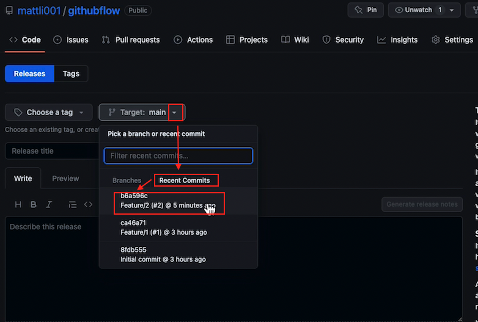
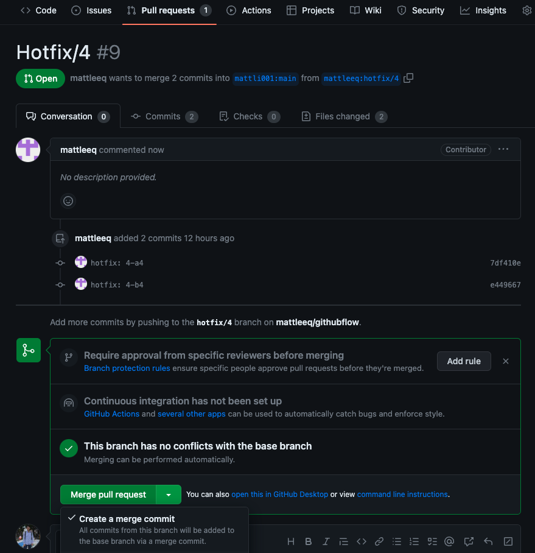
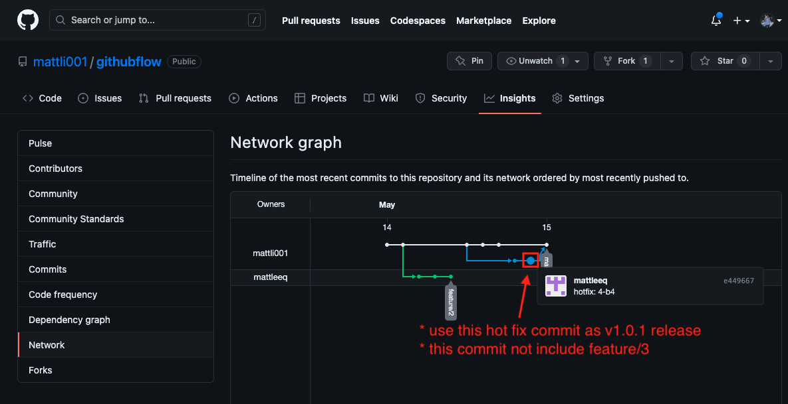
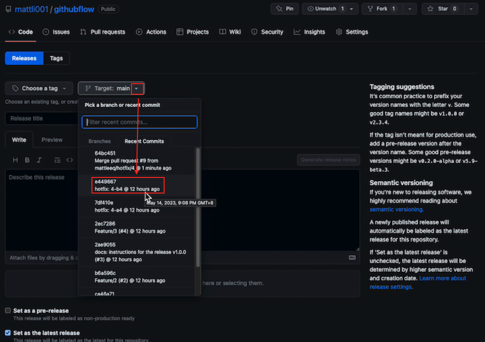
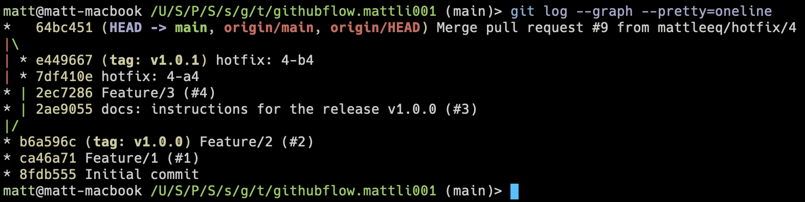

# githubflow

# Reference doc
[A Branching and Releasing Strategy That Fits GitHub Flow](https://hackernoon.com/a-branching-and-releasing-strategy-that-fits-github-flow-be1b6c48eca2)

# Hands on
## feature 1
Different from a blog, open a branch for Feature 1 based on the main branch and develop it locally.

>>
Pull Requests
We adopted Pull Requests, having each developer work in their own fork of the repo. This allows developers to create whatever branches they want without polluting the main fork of the repository.
### a1
```bash
$ git checkout -b feature/1
$ mkdir -p feature/1
$ echo "a1" > feature/1/a1.txt
$ # update README.md
$ git add feature/1/a1.txt README.md
$ git commit -m "feat: 1-a1"
```
### b1 & PR for feature 1
```bash
$ echo "b1" > feature/1/b1.txt
$ # update README.md
$ git add feature/1/b1.txt README.md
$ git commit -m "feat: 1-b1"
$ git push origin feature/1
```

## feature 2
Following the instructions for blog article, development is done in the developer's own forked repository.
From the main repository, fork the main repository using another GitHub account, and create a branch named "feature/2" on the forked repository. Then, clone the forked repository from GitHub and proceed with development locally.

### clone fork repo by developer mattleeq
```bash
$ git clone git@github.com-mattleeq:mattleeq/githubflow.git githubflow.mattleeq
$ cd githubflow.mattleeq
```

### a2
```bash
$ git checkout -b feature/2
$ mkdir -p feature/2
$ echo "a2" > feature/2/a2.txt
$ git add feature/2/a2.txt README.md
$ git commit -m "feat: 2-a2"
```

### b2
```bash
$ echo "b2" > feature/2/b2.txt
$ git add feature/2/b2.txt README.md
$ git commit -m "feat: 2-b2"
```

### c2 & PR to main reop base on feature 2
```bash
$ echo "c2" > feature/2/c2.txt
$ git add feature/2/c2.txt README.md
$ git commit -m "feat: 2-c2"
$ git push origin feature/2
```

## Tagging v1.0.0 and release
Create a new release from the main repository and tag it as v1.0.0. Use select "Recent Commits" to create a release from the latest commit on the main branch.  
  
Full step recording video: [download link](./images/release-v1.0.0.mp4)


## feature 3
Still develop in the main repository, but create a branch named "feature/3" and develop it locally.
```bash
$ git remote update -p
$ git checkout -b feature/3 origin/main
$ mkdir -p feature/3
$ echo "a3" > feature/3/a3.txt
$ git add feature/3/a3.txt
$ git commit -m "feat: 3-a3"
$ echo "b3" > feature/3/b3.txt
$ git add feature/3/b3.txt
$ git commit -m "feat: 3-b3"
$ echo "c3" > feature/3/c3.txt
$ git add feature/3/c3.txt README.md
$ git commit -m "feat: 3-c3"
$ git push origin feature/3
```

PR to main repo base on `feature/3`
```bash
$ git push origin feature/3
```

## hotfix 4
Got a bug report from a user on the v1.0.0 release. Develope in the forked repository, create a branch named "hotfix/4" and develop it locally.
```bash
# add upstream for pull latest code from main repo
git remote add upstream https://github.com/mattli001/githubflow.git
git remote update -p
# checkout hotfix/4 from v1.0.0 tag
git checkout -b hotfix/4 v1.0.0
# fix bug that has 3 commits
echo "hotfix a4" > feature/1/hotfix_a4.txt
git add feature/1/hotfix_a4.txt
git commit -m "hotfix: 4-a4"
echo "hotfix b4" > feature/2/hotfix_b4.txt
git add feature/2/hotfix_b4.txt
git commit -m "hotfix: 4-b4"
git add README.md
git commit -m "docs: update readme for hotfix 4"
```

Push to develper's forked repository
```bash
$ git push origin hotfix/4
```

### Steps for main repo to merge hotfix 4 and release
1. Developer open a PR in the main repo (upstream) base on `hotfix/4`  
Full step recording video: [download link](./images/4.1.open_hotfix4_PR.mp4)
2. The main repo has a hotfix/4 pull request, and we will use the `Merge pull request` option to merge it into the main branch. Please avoid using `Squash and merge` as we intend to preserve the commit history of hotfix 4 for release `v1.0.1`.

3. After `Merge pull request`, we can see the commit history of hotfix 4 is preserved.  
  
`git log` after merge  
```
$ git log --graph --pretty=oneline
*   64bc451 (HEAD -> docs_hotfix, origin/main, origin/HEAD, main) Merge pull request #9 from mattleeq/hotfix/4
|\
| * e449667 hotfix: 4-b4
| * 7df410e hotfix: 4-a4
* | 2ec7286 Feature/3 (#4)
* | 2ae9055 docs: instructions for the release v1.0.0 (#3)
|/
* b6a596c (tag: v1.0.0) Feature/2 (#2)
* ca46a71 Feature/1 (#1)
* 8fdb555 Initial commit
```
4. Then we can create a new release from the main repository and tag it as v1.0.1. Use select "Recent Commits" to create a release from the `hotfix: 4-b4` commit on the main branch.  
  
Full step recording video: [download link](./images/4.4.2.release_v1.0.1.mp4)  
1. After release `v1.0.1`, the commit history `e449667 hotfix: 4-b4` has tag name `v1.0.1`.  

